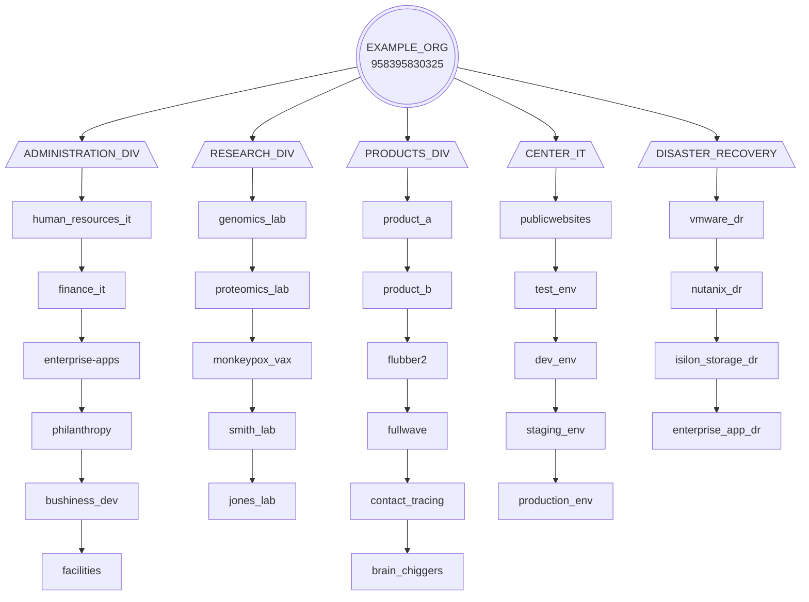

# Example Organization Diagram

```mermaid
flowchart TB
Root((("EXAMPLE_ORG\n958395830325")))
Root --> administration[/ADMINISTRATION_DIV\]
administration --> human_resources_it
human_resources_it --> finance_it
finance_it --> enterprise-apps
enterprise-apps --> philanthropy
philanthropy --> bushiness_dev
bushiness_dev --> facilities
Root --> research[/RESEARCH_DIV\]
research --> genomics_lab
genomics_lab --> proteomics_lab
proteomics_lab --> monkeypox_vax
monkeypox_vax --> smith_lab
smith_lab --> jones_lab
Root --> products_div[/PRODUCTS_DIV\]
products_div --> product_a
product_a --> product_b
product_b --> flubber2
flubber2 --> fullwave
fullwave --> contact_tracing
contact_tracing --> brain_chiggers
Root --> center_it[/CENTER_IT\]
center_it --> publicwebsites
publicwebsites --> test_env
test_env --> dev_env
dev_env --> staging_env
staging_env --> production_env
Root --> disaster_recovery[/DISASTER_RECOVERY\]
disaster_recovery --> vmware_dr
vmware_dr --> nutanix_dr
nutanix_dr --> isilon_storage_dr
isilon_storage_dr --> enterprise_app_dr
```
